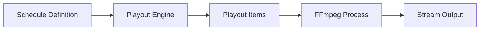

## Overview

Schedules define what content plays on channels and when. ErsatzTV supports multiple schedule types including classic schedules, block schedules, sequential schedules, and scripted schedules.

<Note>
  The primary schedule management interface is through the ErsatzTV web UI. The API focuses on schedule playback control and scripted schedule automation.
</Note>

## Schedule Types

ErsatzTV supports four main schedule types:

<CardGroup cols={2}>
  <Card title="Classic Schedules" icon="list">
    Time-slot based schedules with specific start times for content
  </Card>
  
  <Card title="Block Schedules" icon="calendar-day">
    Programming blocks with ordered content rotations
  </Card>
  
  <Card title="Sequential Schedules" icon="forward">
    Simple sequential playback with optional looping
  </Card>
  
  <Card title="Scripted Schedules" icon="code">
    Advanced schedules using YAML or custom scripting
  </Card>
</CardGroup>

## Playout Control

While schedules are managed through the UI, playouts can be controlled via the API:

### Reset Playout

Force a schedule rebuild from the current time:

```bash
POST /api/channels/{channelNumber}/playout/reset
```

See [Channels API - Reset Playout](/api/channels#reset-channel-playout) for details.

## Scripted Schedules API

Scripted schedules have a dedicated OpenAPI specification available at:

```
GET /openapi/scripted-schedule.json
```

### Scripted Schedule Endpoints

The scripted schedule API provides endpoints for:

- Creating and managing scripted schedules
- Defining custom schedule logic
- Integrating external data sources
- Dynamic content scheduling

<Info>
  Scripted schedules are an advanced feature. Refer to the [Scripted Schedules Guide](/scheduling/scripted-schedules) for detailed documentation.
</Info>

## Schedule Configuration

Schedules are configured through the ErsatzTV web interface:

1. Navigate to **Channels** in the sidebar
2. Select a channel
3. Click **Schedule** tab
4. Choose schedule type and configure content

## Schedule Items

Schedule items represent individual content entries in a schedule. Each item can be:

- **Movie** - Single feature film
- **Episode** - TV show episode
- **Music Video** - Music video clip
- **Song** - Audio track
- **Image** - Still image
- **Collection** - Dynamic collection of media

## Schedule Behavior

### Fill Modes

Schedules can fill remaining time with:

- **Filler Lists** - Predefined filler content
- **Fallback Filler** - Global fallback content
- **Repeating Last Item** - Loop the last scheduled item

### Tail Mode

Controls behavior when content runs longer than scheduled:

- **Smart** - Intelligently adjusts to minimize disruption
- **Offline** - Show offline screen until next item
- **Filler** - Use filler content

## Playout Engine

The playout engine builds schedule playouts:



### Playout Build Modes

From the channel controller implementation:

```csharp
public enum PlayoutBuildMode
{
    Reset,      // Full rebuild from current time
    Continue,   // Continue existing playout
    Refresh     // Refresh without full rebuild
}
```

## Schedule Validation

<Warning>
  Ensure your schedules have valid content sources. Empty schedules will show offline screens or filler content.
</Warning>

Common validation rules:

- At least one content item or collection
- Valid time slots (for classic schedules)
- Media exists and is accessible
- Collections are not empty
- FFmpeg profile is configured

## Best Practices

<CardGroup cols={2}>
  <Card title="Test Schedules" icon="vial">
    Test new schedules on a non-production channel first
  </Card>
  
  <Card title="Use Collections" icon="layer-group">
    Collections provide flexibility and easier content management
  </Card>
  
  <Card title="Monitor Playouts" icon="eye">
    Check playout status regularly to ensure schedules are running correctly
  </Card>
  
  <Card title="Plan Filler" icon="fill">
    Configure appropriate filler content for gaps
  </Card>
</CardGroup>

## Troubleshooting

### Schedule Not Updating

If schedule changes don't appear:

1. Reset the playout via API: `POST /api/channels/{channelNumber}/playout/reset`
2. Check media library scan status
3. Verify collections contain media

### Content Not Playing

If scheduled content doesn't play:

1. Verify media files are accessible
2. Check FFmpeg profile configuration
3. Review logs for transcoding errors
4. Ensure collections are not empty

## Related Endpoints

- [Channels API](/api/channels) - Manage channels and reset playouts
- [Collections API](/api/collections) - Manage media collections used in schedules
- [Libraries API](/api/libraries) - Scan media libraries for new content

## Next Steps

<CardGroup cols={2}>
  <Card title="Collections" icon="layer-group" href="/api/collections">
    Create smart collections for dynamic scheduling
  </Card>
  
  <Card title="Media Items" icon="film" href="/api/media-items">
    Query and manage individual media items
  </Card>
</CardGroup>
